# OpenClaw Manager (OCM)

A local control panel for [OpenClaw](https://github.com/anthropics/openclaw) that makes setup checks, agent management, health inspection, and recovery much easier — without living in JSON and terminal tabs all day.

[中文说明](#中文说明) · [中文使用说明（含截图）](docs/USAGE_GUIDE.zh-CN.md) · [English Guide (with screenshots)](docs/USAGE_GUIDE.en.md)

---

## Why OCM exists

Running OpenClaw directly is powerful, but the day-to-day workflow can get messy fast:

- `openclaw.json` is easy to break by hand
- agent / bot / channel bindings are hard to visualize
- health checks, logs, restarts, and rollback are scattered across terminal commands
- when something goes wrong, recovery is slower than it should be

OCM gives you a **local control panel** for the things that become painful first:
- seeing your current setup clearly
- operating it more safely
- recovering faster when something breaks

## Is OCM for you?

**OCM is a good fit if:**
- you already run OpenClaw locally
- you want a visual control panel for agents, routing, logs, health, and backups
- you are tired of editing nested config by hand
- you want safer rollback / recovery nearby

**OCM is probably not the best starting point if:**
- you have not installed OpenClaw yet
- you expect every OS / channel workflow to be equally mature today
- you want a hosted cloud dashboard instead of a local tool

## What OCM helps you do

### 1) See your OpenClaw setup clearly
- inspect agents and sub-agents in a tree
- verify bindings and routing
- view models, auth, usage, and health in one place

### 2) Operate OpenClaw with less risk
- restart gateway
- inspect logs
- run OpenClaw commands from the built-in terminal
- make config changes with rollback nearby

### 3) Recover faster when things go wrong
- browse backups / snapshots
- roll back config safely
- keep troubleshooting and operational tools close to the same UI

## See it quickly

These are the highest-value surfaces for first-time users:

<p>
  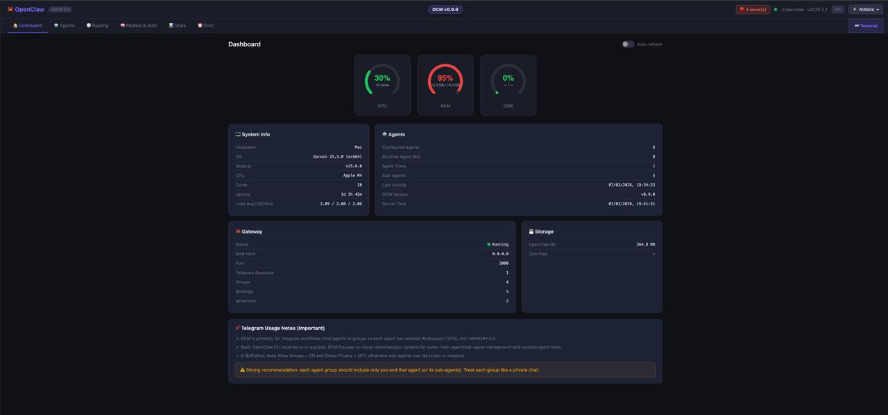
</p>

<p>
  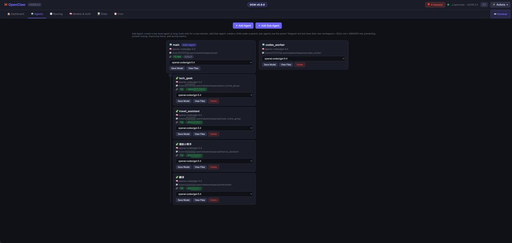
  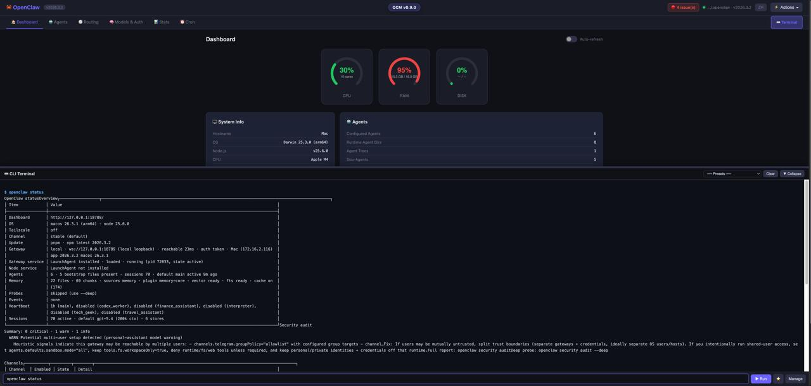
  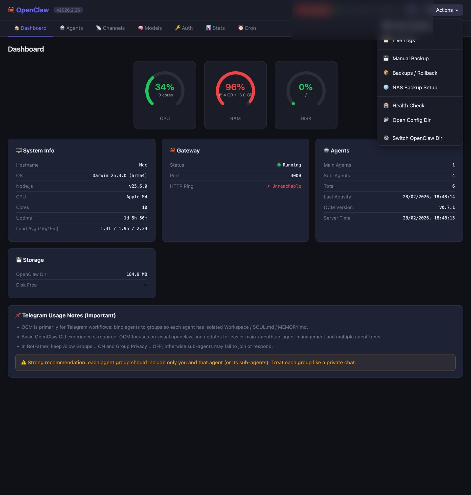
</p>

More screenshots: see the [full usage guide](docs/USAGE_GUIDE.en.md) or the gallery below.

<details>
<summary><b>Full screenshots gallery</b> (redacted: no personal paths, no Telegram IDs)</summary>

<p>
  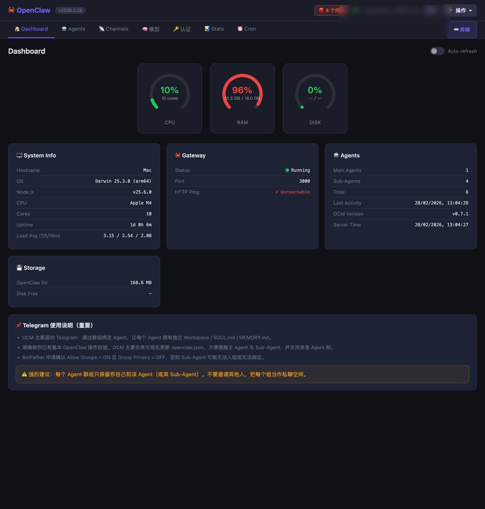
  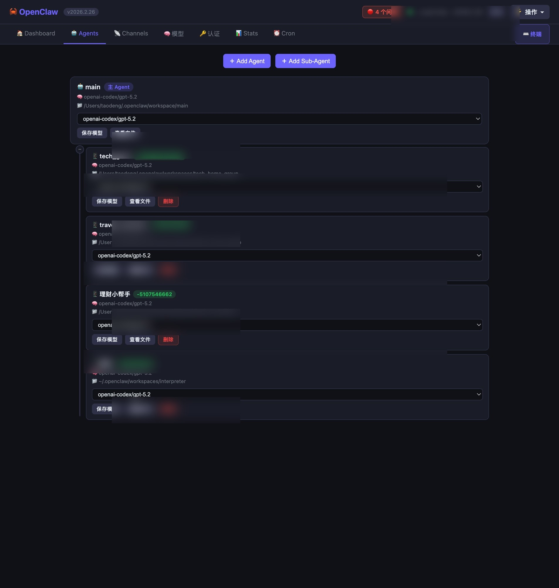
  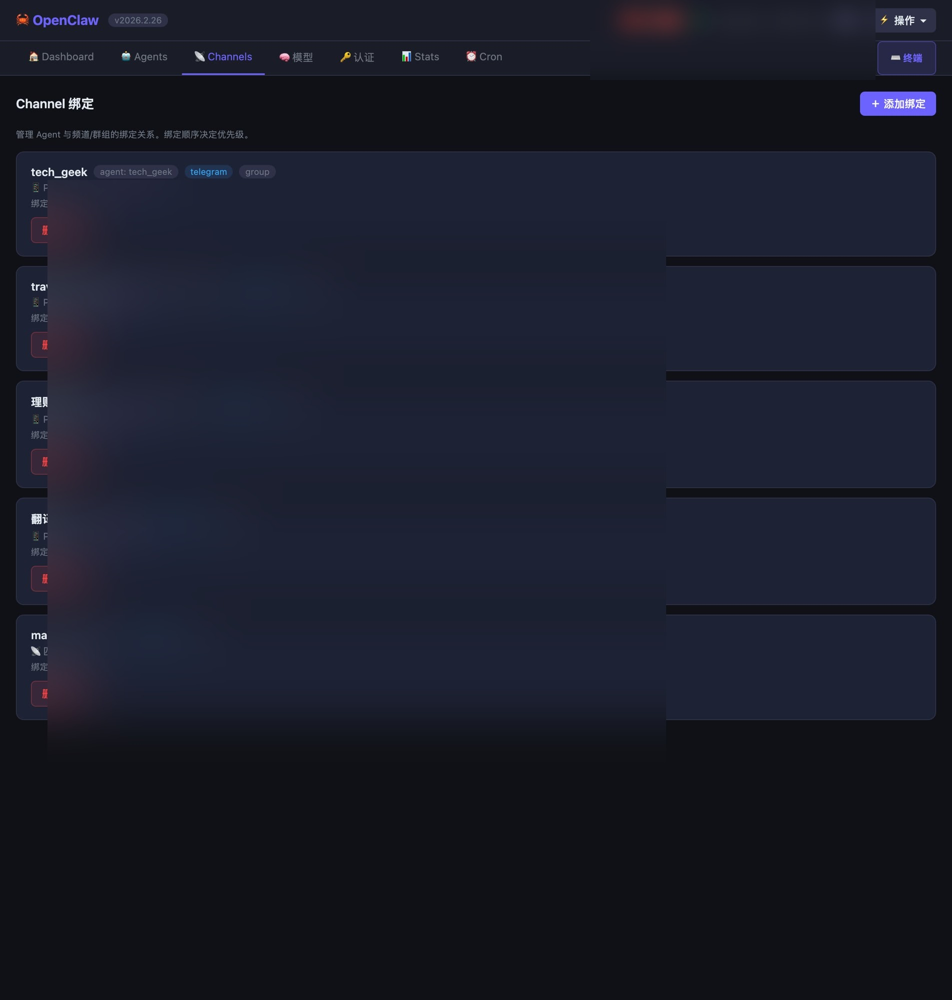
  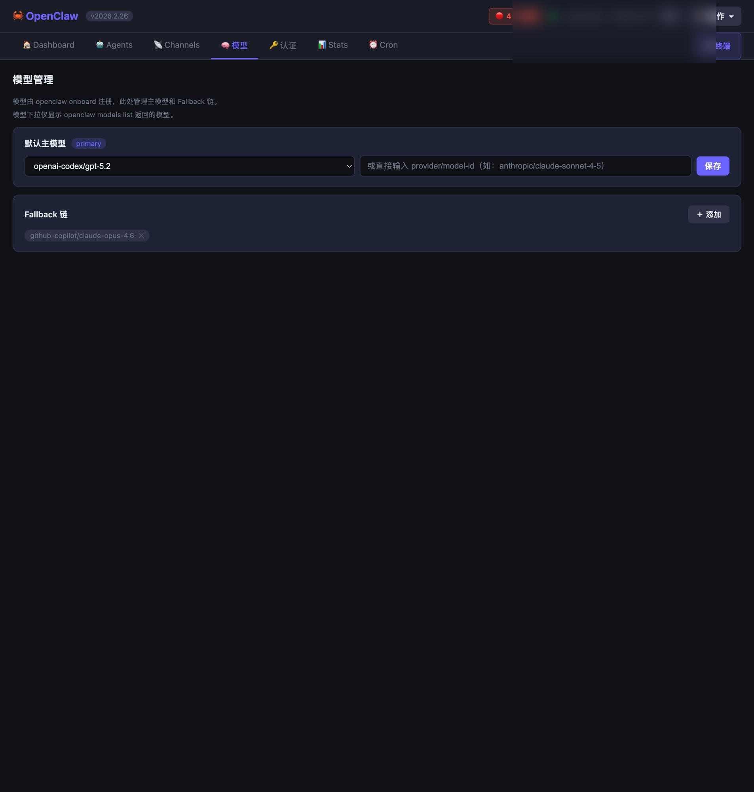
  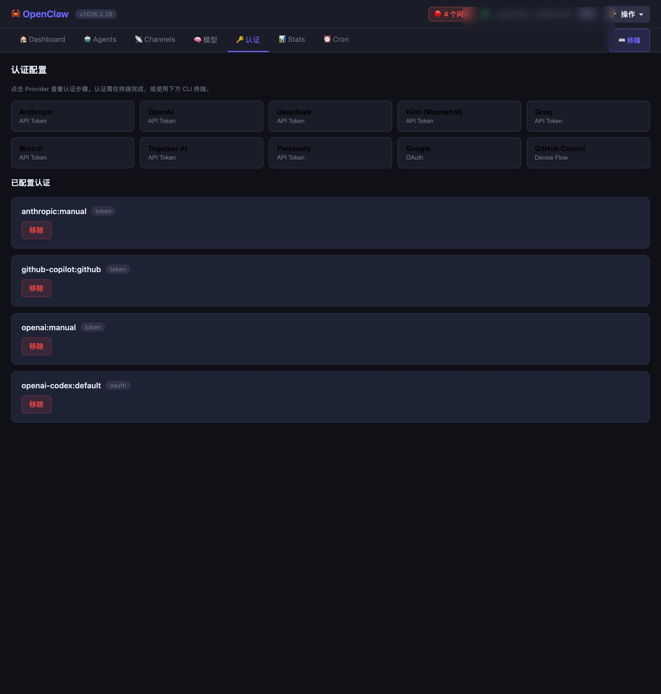
  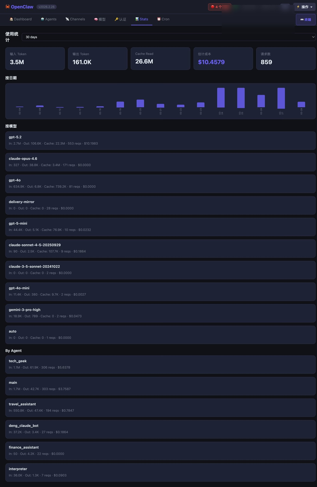
  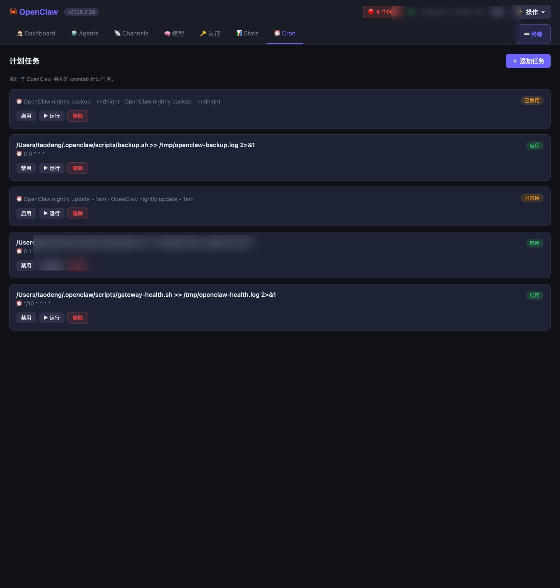
  
  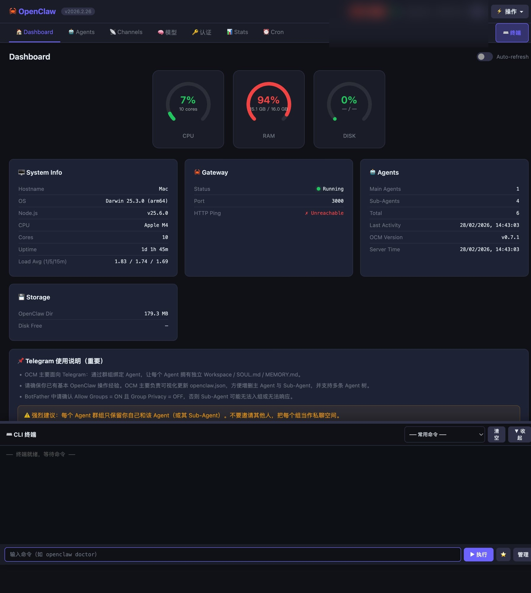
  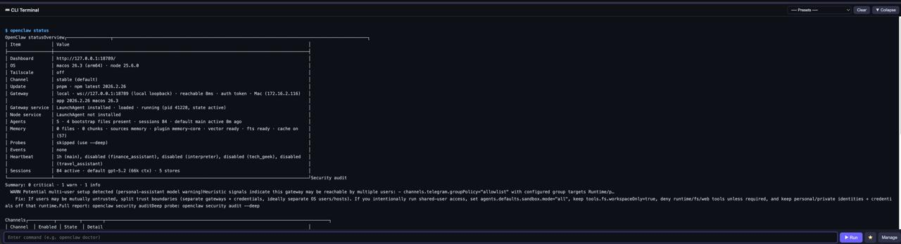
  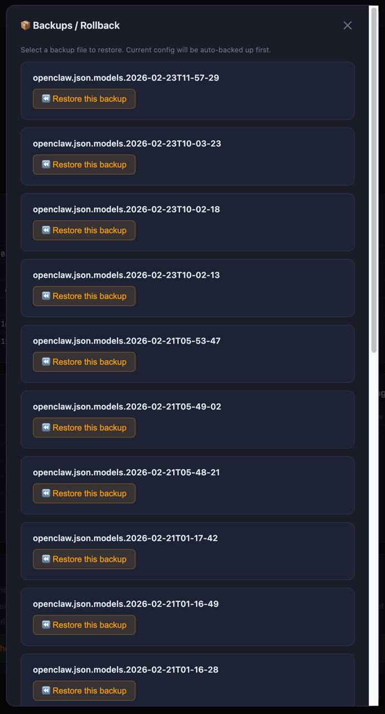
</p>

</details>

## Quick Start (recommended path)

```bash
# Clone
git clone https://github.com/dtzp555-max/ocm.git
cd ocm

# Run (no npm install needed)
bash start.sh        # macOS / Linux
start.bat            # Windows
```

Then open [http://localhost:3333](http://localhost:3333).

For remote access, use:

```bash
bash start.sh --host 0.0.0.0
```

## First-run checklist

For a good first experience, do these first:

1. Confirm OCM found the correct OpenClaw directory
2. Open **Dashboard** and check gateway health
3. Open **Agents** / **Channels** and inspect bindings
4. Open the built-in **Terminal** and run one OpenClaw command
5. Check **Actions** / backup / rollback so recovery is nearby before you need it

## Current support status

**Best supported today**
- macOS / Linux
- local OpenClaw installations
- local health / logs / ops / backup workflows
- Telegram-first agent management workflows

**Supported, but not equally smooth in every case**
- Discord agent / thread workflows
- more advanced routing setups
- mixed environment / service layouts

**Not the primary path today**
- fully beginner-first OpenClaw onboarding
- every OS / shell / service combination
- WhatsApp-heavy sub-agent topology workflows

## Common friction points

The most common reasons OCM feels rough are not usually “the UI is broken”, but environment mismatch:

- OpenClaw itself is not fully healthy yet
- wrong OpenClaw directory
- path / permission issues
- different service/runtime layouts across machines
- channel workflow differences

That is why OCM should be thought of as a **control panel for an existing OpenClaw setup**, not a magic replacement for all installation complexity.

## Docs

- **Start here**: docs/USAGE_GUIDE.en.md
- 中文使用说明: docs/USAGE_GUIDE.zh-CN.md
- FAQ: docs/FAQ.md
- Security notes: docs/SECURITY.md
- Changelog: docs/CHANGELOG.md

## Features by area

- **Agent Management** — Add main agents and sub-agents through a guided setup flow. View all agents in a tree structure with model selection, workspace browsing, and inline configuration.
- **Usage Statistics** — Real token usage data parsed directly from OpenClaw session files. Breakdown by model, agent, and day with a visual chart.
- **Model & Auth** — Configure models from your registered provider list. Follow built-in guides for provider authentication setup.
- **Built-in CLI** — Available from any page (top-right **Terminal** + bottom dock). Run OpenClaw commands with **real-time streaming output**, **Tab completion**, built-in presets, and your own saved favorites.
- **Ops Panel** — Restart gateway, view logs, run health checks, manage backups, **rollback/restore configs**, and handle cron tasks.
- **Backups / Rollback** — Browse auto-snapshots of `openclaw.json*` and restore any previous version (current config is auto-backed up first).
- **Bilingual UI** — English and Chinese interface with one-click language switching.

## What's New (v0.9.x)

- **Discord support (v0.9.x)**: add agent/sub-agent flows for Discord (main agent binds channel; sub-agent binds thread).
- **README screenshots gallery**: screenshots grouped into a collapsible section so the homepage stays shorter.
- **Built-in CLI terminal**: run OpenClaw commands from any page with streaming output, presets, favorites, and Tab completion.
- **Ops actions**: restart gateway, view logs, health check, backups (local + NAS), and cron management.
- **Telegram-first workflow**: safer sub-agent setup flow + allowlist helper + warnings for group privacy.

## Channel Support

OCM is a local UI for OpenClaw. Core features like agent trees, routing, models/auth, ops, backups, and the built-in CLI are channel-agnostic.

Current channel positioning:

- **Telegram** — best supported and most documented today
- **Discord** — supported; recommended for private channels/threads with strict allowlist
- **Feishu / Lark** — supported in broader OpenClaw ecosystems, but not a primary OCM workflow today
- **WhatsApp** — not recommended for sub-agent topology workflows

## Recommended Workflows

OCM is **Telegram-first, not Telegram-only**. Telegram is the smoothest path today, but OCM is also useful for local ops, Discord routing, model/auth management, and backups.

### Telegram Workflow & Safety

OCM is designed primarily for **Telegram-based OpenClaw workflows**:

- Bind Telegram groups to one or more main agents, then create sub-agents under each tree
- Keep each agent's context isolated via independent `workspace`, `SOUL.md`, and `MEMORY.md`
- OCM mainly helps you **safely update `openclaw.json`** via UI instead of manual editing
- Recommended for users who already have basic OpenClaw CLI experience (`onboard`, auth, gateway logs)

Critical Telegram settings:

- In BotFather, keep **Allow Groups = ON**
- In BotFather, set **Group Privacy = OFF**
- For each agent group, keep it private: **only you + that agent/sub-agents**
- Do **not** invite other people to these groups (cost and security risk)

## Requirements

- Node.js 18+ ([download](https://nodejs.org/))
- A working [OpenClaw](https://github.com/anthropics/openclaw) installation

## Configuration

On first launch, OCM auto-detects `~/.openclaw` and creates a local `manager-config.json`. If your OpenClaw config is elsewhere, use **Actions → Switch OpenClaw Dir** or specify it directly:

```bash
bash start.sh --dir /path/to/.openclaw --port 8080
```

Detection priority:

| Priority | Method |
|----------|--------|
| 1 | `--dir` CLI argument |
| 2 | `OPENCLAW_DIR` environment variable |
| 3 | `manager-config.json` in the same folder |
| 4 | `~/.openclaw` (default) |

You can also create `manager-config.json` manually:

```json
{ "dir": "~/.openclaw" }
```

`manager-config.json` is gitignored and won't be committed.

## First-Run Experience

The first thing new users need is confidence that OCM is pointed at the right OpenClaw directory and that the gateway is healthy. The Dashboard, built-in CLI, and health/ops actions are intended to make that first-run check fast and visible.

Recommended first demo flow:

1. Start OCM
2. Open Dashboard and confirm gateway health
3. Open Agents / Routing and inspect bindings
4. Run one CLI command from the built-in terminal
5. Try backup / rollback from Ops

## Remote Access

By default OCM binds to `0.0.0.0` (all interfaces). Access it from another device on your LAN using the IP shown at startup. To restrict to localhost only:

```bash
bash start.sh --host 127.0.0.1
```

## Shell Alias (Optional)

```bash
# Add to ~/.zshrc or ~/.bashrc
alias ocm="bash ~/path/to/ocm/start.sh"
```

## Project Structure

```
ocm/
├── openclaw-manager.js    ← Entire app (server + frontend, single file)
├── start.sh               ← macOS/Linux launcher (auto-detect, port conflict handling)
├── start.bat              ← Windows launcher
├── OpenClaw Manager.app/  ← macOS Finder double-click launcher
├── manager-config.json    ← Local config (gitignored)
├── DEVLOG.md              ← Development log
└── README.md
```

## Tech Stack

- **Runtime**: Node.js built-in modules only (`http`, `fs`, `path`, `os`, `child_process`)
- **Frontend**: Vanilla HTML/CSS/JS embedded in a template literal — no build step, no framework
- **Architecture**: Single-file, zero-dependency, runs anywhere Node.js runs

## License

MIT

---

## 中文说明

OpenClaw Manager（OCM）是一个本地 OpenClaw 控制面板，用来更直观地管理 Agent、查看绑定关系、做健康检查、运行内置 CLI，并在改配置或排错时少踩坑。

### OCM 解决什么问题

直接使用 OpenClaw 很强，但日常维护很容易变成：
- 改 `openclaw.json` 容易手滑
- Agent / bot / 群 / 线程绑定关系很难一眼看清
- 健康检查、日志、重启、回滚散落在多个终端命令里
- 出问题时恢复链路不够顺手

OCM 的定位不是替代 OpenClaw，而是给现有 OpenClaw 环境加一个**本地控制台**。

### 适合谁

**适合：**
- 已经在本机跑通 OpenClaw 的用户
- 想更直观地管理 Agent / Routing / Health / Logs / Backups 的用户
- 不想频繁手改复杂 JSON 的用户

**暂时不太适合：**
- 还没装好 OpenClaw、希望 OCM 包办全部安装复杂度的新手
- 默认期待所有平台 / 所有 channel 路线都同样成熟的用户
- 想要云端托管产品而不是本地工具的用户

### OCM 最有价值的三件事

1. **看清你的 OpenClaw 结构**
   - Agent 树、绑定关系、模型、认证、健康状态更直观
2. **更安全地做运维操作**
   - 重启 gateway、看日志、跑 CLI、改配置、回滚更顺手
3. **出问题时恢复更快**
   - 备份、回滚、排查入口都更近

### 快速开始

```bash
git clone https://github.com/dtzp555-max/ocm.git
cd ocm
bash start.sh        # macOS / Linux
start.bat            # Windows
```

打开 [http://localhost:3333](http://localhost:3333)。

### 第一次使用建议先做这几步

1. 确认 OCM 找到了正确的 OpenClaw 目录
2. 打开 **Dashboard** 看 gateway 是否健康
3. 打开 **Agents / Channels** 看绑定是否正确
4. 打开内置 **Terminal** 跑一条 OpenClaw 命令
5. 看一眼 **Actions / 备份 / 回滚**，确保恢复路径就在手边

### 当前支持定位

**目前最好用的场景：**
- macOS / Linux
- 本地 OpenClaw 环境
- 本地 health / logs / ops / backup 工作流
- Telegram-first 的 Agent 管理方式

**支持，但不保证同样顺滑：**
- Discord workflow
- 更复杂的 routing / service 布局
- 混合环境

### 文档

- 英文使用说明：docs/USAGE_GUIDE.en.md
- 中文使用说明：docs/USAGE_GUIDE.zh-CN.md
- FAQ：docs/FAQ.md
- 安全说明：docs/SECURITY.md
- 更新记录：docs/CHANGELOG.md
