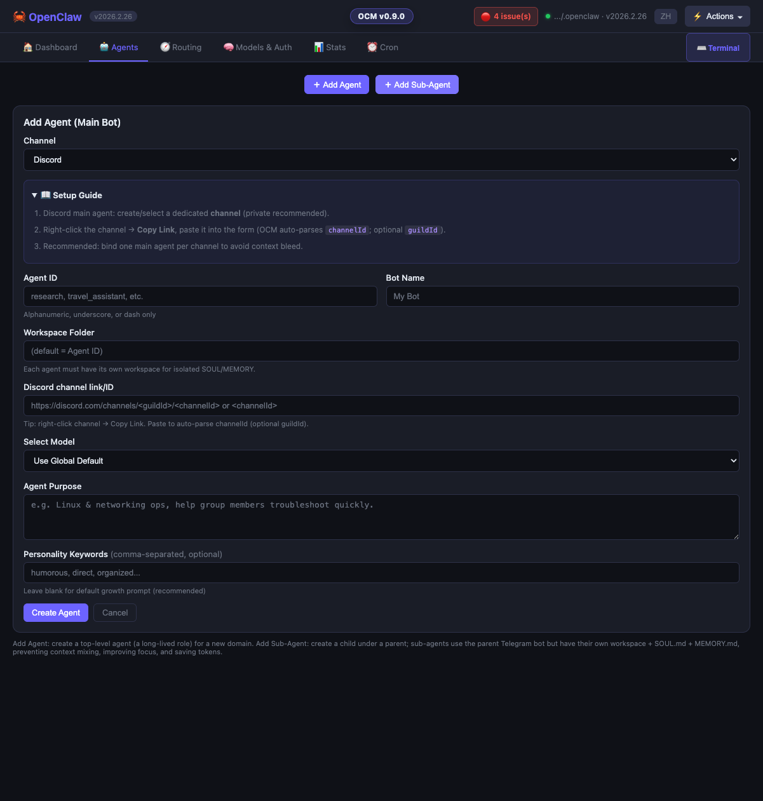
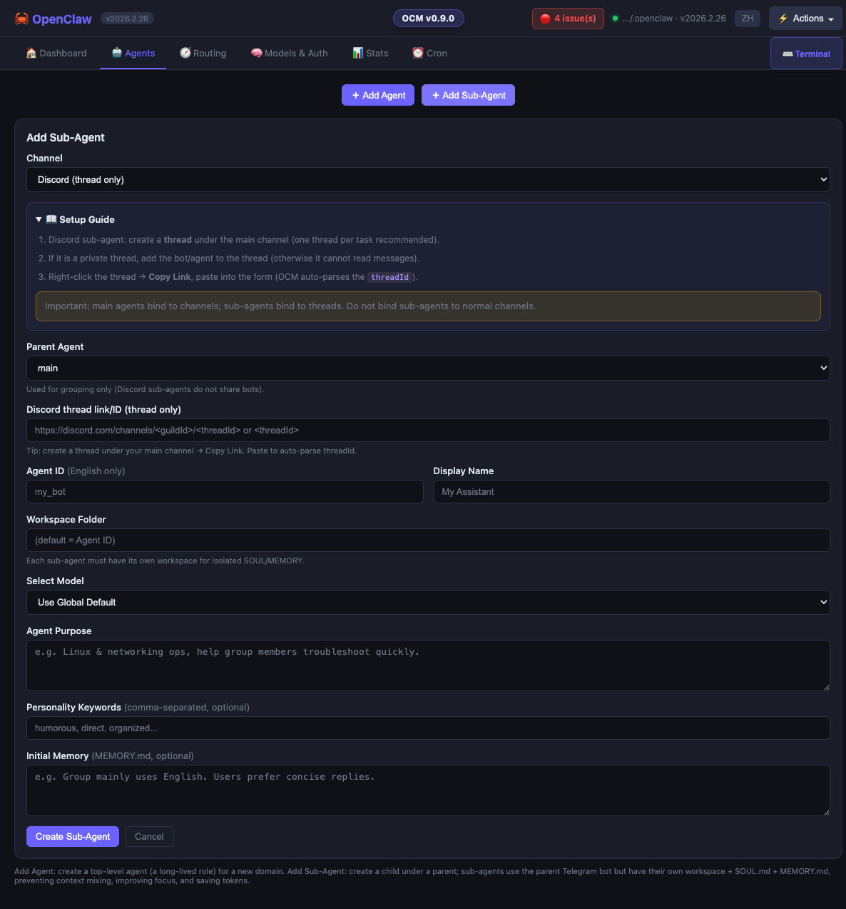

# OCM Usage Guide (with screenshots)

> Audience: People who already have OpenClaw running locally (you can run `openclaw status` and read `openclaw gateway logs`).
>
> Goal: Use **OpenClaw Manager (OCM)** as an **OpenClaw control panel** for agent setup, routing, health checks, built-in CLI, and safer config changes.

---

## 0) The pain: why OCM exists

Creating and maintaining OpenClaw agents is powerful, but the “default workflow” is often messy:

1) **Editing `openclaw.json` is risky**
- Deep/nested config, many fields.
- One accidental overwrite can break multiple agents (tokens, bindings, accountIds).

2) **Sub-agent topology is hard to see**
- With multiple bots + multiple groups, it’s not obvious which agent is bound to which Telegram peer.

3) **Model IDs are easy to misconfigure**
- A wrong `provider/model-id` can silently degrade performance, cause timeouts, or produce “typing…” with no reply.

4) **Usage and troubleshooting take time**
- Without tooling, you’re digging through JSONL sessions and gateway logs to answer: “who used tokens?”, “what failed?”, “which provider?”

OCM’s role: **a zero-dependency local UI** that helps you view and update OpenClaw configuration safely, keep changes auditable, and centralize common ops.

---

## 1) Why Telegram groups are the best way to build sub-agents

Think of it as:

> **One Telegram group = one agent boundary** (context + purpose + workspace).

### Benefits

1) **Clear isolation**
- Each agent speaks only inside its own group.
- Less cross-contamination between tasks.

2) **Controllable context**
- The group chat is the agent’s input stream.
- You can keep an agent “clean” by keeping the group focused.

3) **Natural delegation**
- A main agent can coordinate; sub-agents can specialize (tech / travel / finance / translation, etc.).

4) **Auditable**
- You can see exactly which message triggered which response.

### Safety / cost: keep groups private

Recommended rule:

- **Each agent group should contain only you + the bot** (and optionally your second account).
- Don’t invite other people:
  - cost: anyone can trigger token usage
  - safety: higher risk of prompt-injection / accidental tool actions

---

## 2) First-run mindset

For new users, the first win is not “configure everything” — it is:

1. Confirm OCM found the right OpenClaw directory
2. Confirm the gateway is healthy
3. Confirm you can inspect agents / bindings
4. Confirm the built-in CLI works

That is why Dashboard + Routing + built-in CLI are the most important first-run surfaces.

## 3) Start OCM (macOS)

From the repo directory:

```bash
bash start.sh
```

Then open: <http://localhost:3333>

Restrict to localhost only:

```bash
bash start.sh --host 127.0.0.1
```

---

## 4) Dashboard: check health first

The Dashboard is your “sanity check”:

- CPU / RAM / Disk
- gateway running status
- agent counts

Screenshot:


---

## 5) Create a main agent (with its own Telegram bot)

> Your `main` agent usually exists already. This section is for creating an additional **root agent** that owns its own Telegram bot/account.

### 5.1 BotFather prerequisites

1) Create a bot
- In Telegram, open **BotFather**
- Run `/newbot` → follow prompts → copy the bot token

2) Allow groups
- BotFather → your bot → Bot Settings
- **Allow Groups = ON**

3) Disable group privacy (critical)
- BotFather → your bot → Bot Settings → Group Privacy
- **Group Privacy = OFF**

If group privacy is ON, the bot can’t see normal group messages. The symptom often looks like:
- slow replies
- “typing…” appears frequently
- sometimes no response at all

### 5.2 Add the agent in OCM

Go to **Agents**:


Click `+ Add Agent` and fill:

- agent id / name
- workspace path (recommended: separate folder per agent)
- model (dropdown is sourced from `openclaw models list`)
- the BotFather token
- **Skills & Tools** (optional): expand the collapsible picker at the bottom to customize. By default, new agents get: `memory-continuity`, `agent-workflow`, `execution-agent-dispatch`, `session-logs` as Skills, and `group:fs`, `group:runtime`, `group:memory`, `sessions_spawn`, `subagents` as Tool Groups. Use the quick-action buttons (Default / All / None) to adjust.

OCM writes the agent + Telegram account/binding + skills + tool groups into `openclaw.json`.

---

## 6) Create a sub-agent (recommended workflow)

### 6.1 Why a new group per sub-agent

- clean context isolation
- easier debugging
- easy to “turn off” by muting a group

### 6.2 Step-by-step

In **Agents** → `+ Add Sub-Agent`:

**Step 1 — Create a Telegram group**
- private group
- add only: you + the bot

**Step 2 — Get the Group ID (peer id)**

Use gateway logs:

```bash
openclaw gateway logs --follow
```

Send a message in the new group. In logs you should see something like:

- `-100xxxxxxxxxx` (Telegram group id)

**Step 3 — Fill the sub-agent form**
- choose the Parent Agent (which bot/account to share)
- paste the Group ID
- set workspace (recommended: its own folder)
- choose model
- **Skills & Tools** (optional): same picker as Add Agent — defaults are pre-selected, expand to customize

**Step 4 — Allowlist (optional but recommended)**

If you use `channels.telegram.allowFrom`, OCM can take “Your Telegram User ID” and append it automatically to the allowlist.

---


## 6.5) Discord workflow (main agent + sub-agent)

OCM also supports Discord:

- **Main agent**: bind to a dedicated **Channel** (channelId)
- **Sub-agent**: bind to a dedicated **Thread** under that channel (threadId)

### 6.5.1 Add a Discord main agent

Go to **Agents** → `+ Add Agent` → set **Channel = Discord**:



Steps:
1) Create/select a dedicated Discord **channel** (private recommended)
2) Right-click channel → **Copy Link** → paste into the form (auto-parses channelId)

### 6.5.2 Add a Discord sub-agent (thread-first)

Go to **Agents** → `+ Add Sub-Agent` → set **Channel = Discord (thread only)**:



Steps:
1) Create a **thread** under the main channel (one thread per task)
2) If it is a private thread, add the bot to the thread
3) Right-click thread → **Copy Link** → paste into the form (auto-parses threadId)

## 7) Verify bindings (Channels)

Go to **Channels**:


Here you can quickly validate:
- which agent is bound to which Telegram peer
- whether `main` has the catch-all binding (if you use that pattern)

---

## 8) Model settings (Models)

Go to **Models**:


Key idea:
- OCM uses the real CLI model list (`openclaw models list`) for dropdowns.
- This reduces “invalid model-id” mistakes.

---

## 8) Credentials (Auth)

Go to **Auth**:


Use this page to:
- see which provider profiles exist
- troubleshoot expired/missing tokens

---

## 9) Usage stats (Stats)

Go to **Stats**:


You can break down usage by:
- model
- agent
- time window

OCM parses usage from OpenClaw session JSONL files.

---

## 10) Actions menu (ops shortcuts)

The **⚡ Actions** dropdown in the top-right provides common operational shortcuts:
- Restart Gateway
- Live Logs
- Manual Backup / Backups & Rollback
- NAS Backup Setup
- Health Check
- Open Config Dir / Switch OpenClaw Dir

Screenshot:


## 10) Cron jobs (Cron)

Go to **Cron**:


You can:
- see scheduled tasks (backup / update / health)
- run tasks manually
- enable/disable entries

---

## 11) Built-in CLI Terminal

OCM includes a built-in terminal panel to run OpenClaw CLI commands directly (for example: `openclaw status`, `openclaw gateway logs --follow`, `openclaw doctor`).

How to open: click **⌨️ Terminal** in the top navigation, or use the bottom CLI panel.

Highlights:
- **Tab completion** while typing commands
- **Common commands** dropdown to insert templates quickly
- **Favorites**: save frequently used commands and run them with one click
- **Streaming output** (stdout/stderr) for faster debugging

Screenshot:


## 11) Fast troubleshooting

### “Typing…” but no reply in a Telegram group

Check (in order):

1) BotFather: **Group Privacy = OFF**
2) `openclaw status` (gateway healthy?)
3) provider auth / rate limit issues (Auth page + gateway logs)

### Model dropdown doesn’t show a model you expect

- dropdown comes from `openclaw models list`
- ensure the model is registered/visible in your OpenClaw environment

---

## Notes about screenshots

All screenshots in this guide are **redacted** (no personal paths, no Telegram IDs).
They live under `docs/redacted-screenshots/`.
